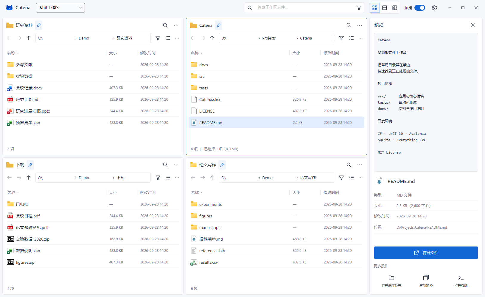
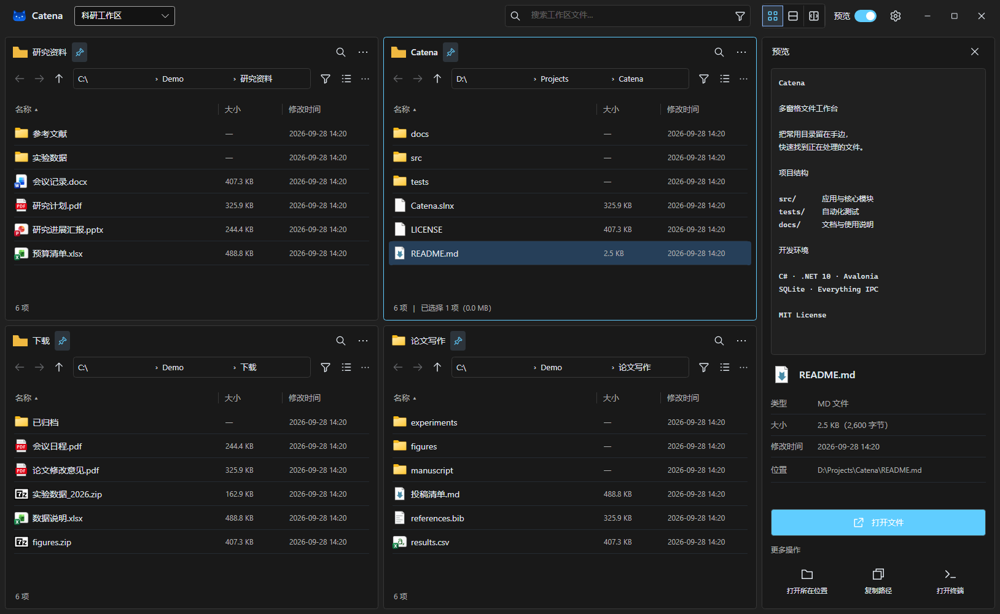

<div align="center">


# Catena

**把常用目录留在手边，快速找到正在处理的文件。**

Windows 多窗格文件工作台 · Everything 索引 · AI 辅助查找与整理

**简体中文** · [English](README.en.md)

[](https://github.com/Xyy-tj/Catena/actions/workflows/build.yml)
[](https://github.com/Xyy-tj/Catena/releases/latest)

[](LICENSE)

[下载最新版](https://github.com/Xyy-tj/Catena/releases/latest) · [快速开始](#快速开始) · [功能一览](#功能一览) · [参与开发](#参与开发) · [反馈问题](https://github.com/Xyy-tj/Catena/issues)

</div>



<p align="center"><sub>真实界面渲染，使用虚构目录与演示文件。本文介绍当前开发分支，下载版本的功能请以发布说明为准。</sub></p>

## 为什么做 Catena

写论文、处理项目或整理资料时，源文件、下载目录、参考文献和输出文件往往散在不同位置。Catena 让这些目录同时出现在一个窗口里，用 Everything 查找文件，再回到指定窗格继续工作。需要整理思路时，可以结合当前目录向自己的 AI 模型提问。

项目处于早期迭代阶段，当前面向 Windows x64。界面以中文为主；英文 README 用于介绍项目，并不代表应用已经完成英文适配。

## 功能一览

| 能力        | 你可以做什么                                         |
| :-------- | :--------------------------------------------- |
| **多窗格浏览** | 切换单窗格、左右双窗格、上下双窗格与四窗格；拖动分隔线，自由分配空间             |
| **独立导航**  | 每个窗格有自己的路径、目录树、筛选、排序和固定位置，支持系统文件夹选择器           |
| **统一查找**  | 在同一个入口选择当前窗格、工作区或此电脑；结果定位回发起搜索的窗格              |
| **工作区记忆** | 自动保存布局、路径、选中项与缩放；为不同任务保存、切换工作区                 |
| **文件预览**  | 查看图片、文本、代码和 PDF；通过本机预览处理程序查看 PowerPoint 与 Word |
| **常用位置**  | 访问收藏和近期目录，自动发现 OneDrive，缓存目录结构与文件类型统计          |
| **日常操作**  | 多选、复制、粘贴、重命名、删除、复制路径、打开终端及在资源管理器中显示            |
| **AI 助手** | 用自然语言查找文件，讨论目录组织；支持流式回复和粘贴文件、图片                |
| **外观与更新** | 浅色、深色、跟随系统及蓝雾背景；自动或手动检查正式版本更新                  |

### 多个目录，同时在场

窗格之间保持独立，切换布局时保留隐藏窗格的状态。Windows 文件类型图标、紧凑的列表和可编辑面包屑延续熟悉的浏览习惯。`Ctrl + 滚轮` 调整当前窗格的列表大小，拖动边界调整布局，双击分隔线恢复均分。

<details>
<summary><strong>查看深色工作区</strong></summary>



</details>

### Everything 查找，一个入口

顶部输入文件名、关键词或完整路径，也可以点击窗格自己的搜索图标。结果在独立窗口展示，双击即可定位文件。

Catena 通过 **Everything Unicode IPC** 直接查询索引。日常搜索不需要为每次查询启动命令行进程或写入临时结果文件。安装包包含 Everything 官方安装组件，已安装的环境会复用现有组件；首次索引仍需要等待建立完成。

<p align="center"></p>

搜索范围包含子目录。索引不可用时，界面提供明确的当前目录扫描入口。普通输入按关键词匹配，暂不接受完整的 Everything 高级查询语法。

### 支持自定义模型配置

在设置里填写 **OpenAI 兼容接口的 Base URL、模型 ID 和 API Key**，即可启用 AI 功能。支持兼容的云端接口和本机服务模型。

- **AI 查找**：例如“找上个月修改的预算 Excel 表”。模型把描述转换成文件名、扩展名、日期和大小条件，再查询本地索引。
- **目录对话**：从窗格的 `⋯` 菜单进入，询问目录组织、命名或归档建议。
- **附件与流式回复**：支持 `Ctrl + V` 粘贴文本、文件和剪贴板图片，逐步展示回复，可停止生成或复制内容。

<p align="center"></p>

<p align="center"><sub>对话为演示文案，未调用外部模型。实际回复与图片、附件能力取决于所配置的服务。</sub></p>

AI 查找目前基于文件元数据，尚不支持文档全文语义检索。整理建议由用户决定如何执行，AI 不会自动移动或删除文件。

## 快速开始

### 安装与运行

1. 打开 [Releases](https://github.com/Xyy-tj/Catena/releases/latest)，下载 Windows x64 安装包 `Catena-<版本>-win-x64-Setup.exe`。
2. 运行安装程序。安装包自带 .NET 运行时和搜索安装组件；缺少 Everything 时自动安装，安装阶段可能出现管理员授权提示。
3. 启动 Catena，在各窗格选择常用目录。等待 Everything 首次索引完成后，即可使用快速查找。

发布包不需要单独安装 .NET SDK。使用便携目录时，请保留整个目录；需要搜索组件时，在 **设置 → Everything → 安装组件** 中完成安装。

当前支持 Windows 10 1809 及以上的 x64 系统，推荐在 Windows 11 上使用。详见 [安装与打包说明](docs/installation.md)。

### 配置 AI（可选）

打开 **设置 → AI 功能**，填写服务商提供的接口地址和模型 ID，输入密钥后测试连接并保存。本机无鉴权服务可留空密钥，例如 `http://localhost:1234/v1`。服务需要兼容 Chat Completions；图片输入还需要模型支持视觉能力。

### 版本更新

打开 **设置 → 关于** 查看当前版本、检查结果与发布页面。自动检查默认开启，保存设置后生效：启动约 10 秒后后台检查，持续运行期间每 24 小时再检查一次。发现新版本时，**关于** 标签旁显示 **新版本** 标识。安装由用户从发布页面下载后进行。

### 常用快捷键

| 快捷键               | 操作         |
| :---------------- | :--------- |
| `Ctrl + K`        | 聚焦全局搜索     |
| `Ctrl + L`        | 编辑当前窗格路径   |
| `F6`              | 切换活动窗格     |
| `F5`              | 刷新当前目录     |
| `Alt + ← / → / ↑` | 后退、前进、上级目录 |
| `Alt + P`         | 显示或隐藏预览    |
| `Ctrl + 滚轮`       | 缩放当前文件列表   |

## 本地数据与隐私

浏览、普通搜索和预览在本机处理。工作区、目录缓存和设置保存在 `%LOCALAPPDATA%\Catena`。OneDrive 目录扫描只读取元数据，自动预览不会下载仅在线的文件正文。

AI 功能在用户提交时连接配置的模型服务。查找会发送查询描述；对话可附带当前目录路径、文件名及结构统计，也会发送用户主动选择的附件。对话中可以关闭目录上下文。API Key 使用 Windows 当前用户的 DPAPI 加密保存。

自动更新检查会连接 GitHub 公共发布接口，获取版本信息，不附带目录列表、文件正文或模型密钥。可在设置中关闭。

## 技术栈

Catena 使用 C# 和 Avalonia 构建桌面界面，无需 Electron 或内嵌浏览器。文件列表使用虚拟化，图标在后台读取并缓存，文件搜索与预览避免阻塞界面线程。

| 层次         | 实现                                                        |
| :--------- | :-------------------------------------------------------- |
| 桌面界面       | .NET 10 · Avalonia 12 · Fluent 主题 · CommunityToolkit.Mvvm |
| 文件与状态      | 本地文件系统 · SQLite 工作区与目录缓存                                  |
| 快速检索       | Everything Unicode IPC · 结构化查询条件                          |
| AI         | OpenAI 兼容 HTTP 接口 · SSE 流式响应                              |
| Windows 集成 | 系统文件图标 · COM 预览处理程序 · Windows PDF 引擎 · DPAPI              |
| 验证与分发      | xUnit · Avalonia Headless · GitHub Actions · Inno Setup   |

```text
src/
├─ Catena.App               桌面界面、窗格与预览交互
├─ Catena.Core              导航与工作区模型
├─ Catena.Contracts         文件、搜索、预览及 AI 接口
├─ Catena.Storage.Local     目录浏览、结构扫描与基础预览
├─ Catena.Search.Everything 索引连接与查询编译
├─ Catena.AI                搜索规划、流式对话与附件处理
├─ Catena.Persistence       SQLite 与设置持久化
└─ Catena.Platform.Windows  图标、文件操作及原生预览
```

## 参与开发

准备 Windows x64 和 [.NET SDK](https://dotnet.microsoft.com/download)（版本见 [global.json](global.json)，当前为 `10.0.401`），在仓库根目录运行：

```powershell
git clone https://github.com/Xyy-tj/Catena.git
cd Catena
./scripts/dev.ps1 restore
./scripts/setup-everything.ps1
./scripts/dev.ps1 build
./scripts/dev.ps1 test
./scripts/dev.ps1 run
```

`setup-everything.ps1` 下载并校验官方搜索组件，首次执行需要网络。仓库若存在 `.tools/dotnet`，开发脚本会优先使用该 SDK。

```powershell
# 生成自包含便携目录
./scripts/dev.ps1 publish

# 生成安装包，需要 Inno Setup 6.7+
./scripts/package.ps1
```

便携程序输出到 `artifacts/win-x64/Catena.App.exe`，安装包输出到 `artifacts/installer/`。更多背景见 [开发说明](docs/development.md)。

欢迎提交 [Issue](https://github.com/Xyy-tj/Catena/issues) 或 Pull Request。报告问题时请附上应用版本、Windows 版本和复现步骤；涉及预览时，优先提供不含私人信息的最小样例。较大的功能改动建议先在 Issue 中讨论范围。

## 后续更新方向

- PowerPoint、Word 的完整预览依赖本机可用的预览处理程序。PPTX 兼容预览无法完全还原复杂母版、组合图形和图表；大型 Office 文件首次加载仍可能较慢。
- 目录结构缓存尚未接入文件系统实时监听，需要刷新以反映部分外部变更。
- 当前尚未实现跨窗格拖放、剪切移动、批量操作与文档全文语义检索。
- macOS、Linux、插件系统及完整英文界面尚未提供；当前开发优先保证 Windows 日常使用体验。

## 许可与致谢

Catena 源码采用 [MIT License](LICENSE)。感谢 [Avalonia](https://github.com/AvaloniaUI/Avalonia)、[Everything](https://www.voidtools.com/)、[SQLite](https://www.sqlite.org/)、[CommunityToolkit](https://github.com/CommunityToolkit/dotnet)、[Lucide](https://lucide.dev/) 与 [Octicons](https://primer.style/octicons/)。

Everything 安装组件保留其自身许可；第三方图标的许可见 [ThirdParty](src/Catena.App/Assets/ThirdParty/)。项目图标与背景来源见 [资源说明](src/Catena.App/Assets/README.md)，界面图片说明见 [截图说明](docs/images/README.md)。
